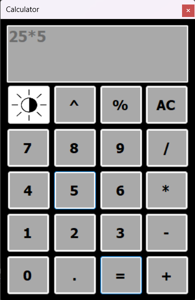
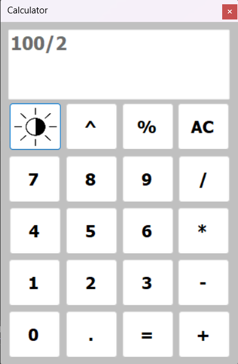

# Simple Calculator Application 🧮

A functional desktop calculator built using **C#** and **Windows Forms (.NET)** featuring standard arithmetic operations and a dynamic Dark/Light theme toggle.

## 📸 Screenshots

| Dark Theme | Light Theme |
| :---: | :---: |
|  |  |

## 🚀 Features

* **Basic & Advanced Operations**: Supports Addition (+), Subtraction (-), Multiplication (*), Division (/), Exponentiation (^), and Modulus (%)[span_1](start_span)[span_1](end_span).
* **Theme Switching**: Includes a UI toggle for switching seamlessly between **Dark Mode** and **Light Mode**[span_2](start_span)[span_2](end_span).
* **Dynamic Display**: Formats expressions directly on the screen for intuitive operation sequences[span_3](start_span)[span_3](end_span).
* **Reset Functionality**: Clear button (AC) to wipe current inputs and operational memory[span_4](start_span)[span_4](end_span).

## 🛠️ Built With

* **Language**: C#
* **Framework**: .NET / Windows Forms
* **IDE**: Visual Studio

## 🖥️ How to Run

1. Clone the repository:
   ```bash
   git clone [https://github.com/Muhammad-sadaka/Calculator.git](https://github.com/Muhammad-sadaka/Calculator.git)

